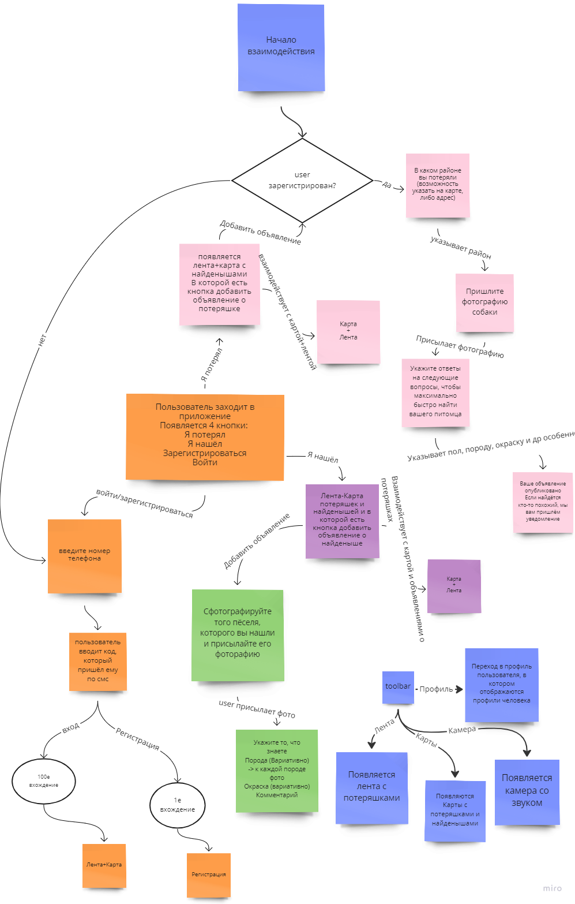
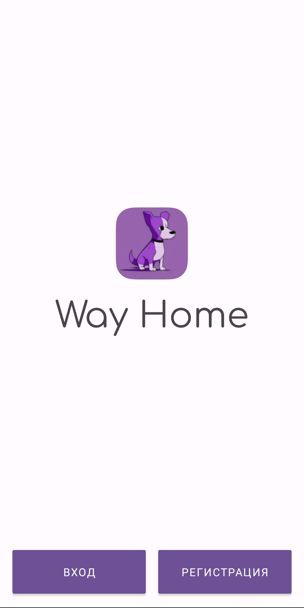
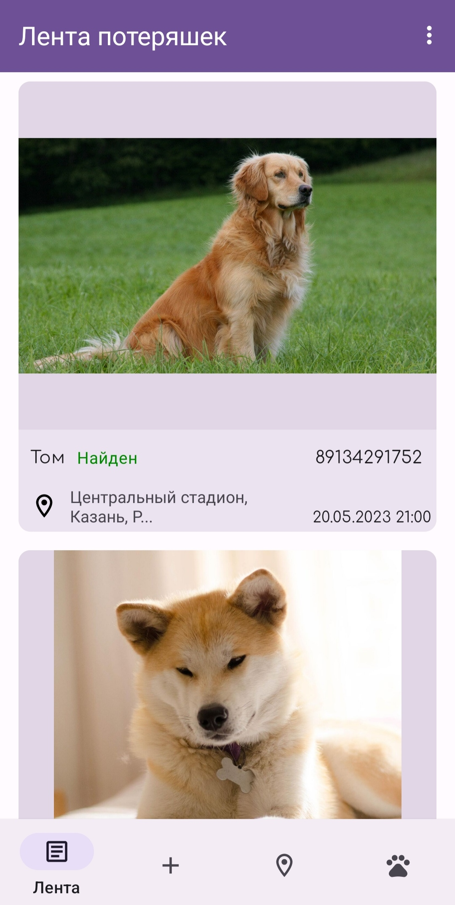
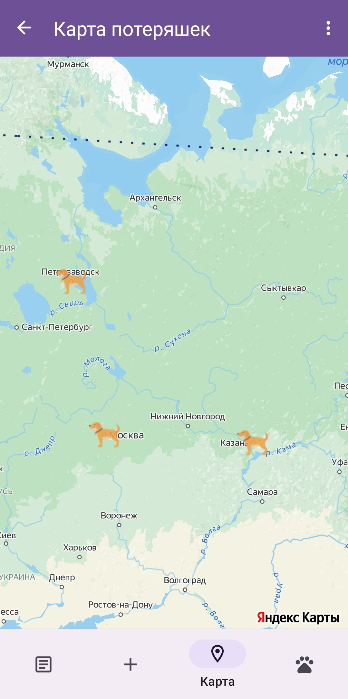
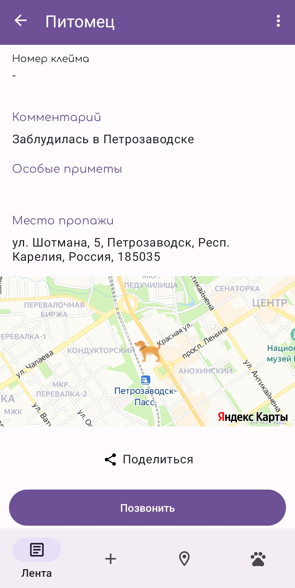

# WayHome
Приложение для поиска пропавших животных

[Презентация](https://docs.google.com/presentation/d/1QaOjh68vT4_pAFkIMZVXuPMEJGufJAe-/edit?usp=share_link&ouid=112587626402750342206&rtpof=true&sd=true)

### Описание
Приложение, которое позволяет пользователю найти его потеряшку 
либо вернуть найденыша своему хозяину. 

В удобных картах, на которых будут отображаться метки с найденными собаками, 
а также метки, в которых будет отмечено, где хозяин потерял потеряшку. 

Лента объявлений с найденышами и потеряшками, из которой можно быстро переместиться на карту.
Есть возможность редачить объявления о потеряшках и найденышах. 
В камере есть пищалки, кряканье и звук насыпающегося корма. 
Лента потеряшек отображаются объявления о потеряшках и найдёнышах.
Фильтры по всем характеристикам собаки из профиля Объявление о потеряшке

### UserFlow

### Обзор
#### Регистрация
Логин-Пароль

#### Лента потеряшек и список своих объявлений
 

#### Карта потеряшек

#### Добавление новой потеряшки
 

#### Карточка питомца
 

#### Профиль

#### Обратная связь

